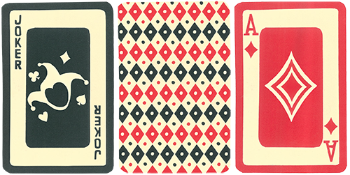

<a name="readme-top"></a>
<!-- PROJECT LOGO -->
<br />
<div align="center">
  <a href="https://github.com/github_username/repo_name">
    
  </a>

<h3 align="center">Bizarre Poker</h3>

  <p align="center">
    Web application for playing oldschool card game in modern way.
    <br />
    <a href="#usage"><strong>Explore Usage topic »</strong></a>
    <br />
    <br />
    <!-- LINK TO DEMO
    <a href="https://github.com/github_username/repo_name">Open Demo</a>
    · -->
    <a href="https://github.com/MishaVyb/bizarre-poker/issues">Report Bug</a>
    ·
    <a href="https://github.com/MishaVyb/bizarre-poker/issues">Request Feature</a>
  </p>
</div>


<!-- TABLE OF CONTENTS -->
<details>
  <summary>Table of Contents</summary>
  <ol>
    <li>
      <a href="#about-the-project">About The Project</a>
      <ul>
        <li><a href="#built-with">Built With</a></li>
      </ul>
    </li>
    <li>
      <a href="#getting-started">Getting Started</a>
      <ul>
        <li><a href="#prerequisites">Prerequisites</a></li>
        <li><a href="#installation">Installation</a></li>
      </ul>
    </li>
    <li><a href="#usage">Usage</a></li>
      <ul>
        <li><a href="#data">Data</a></li>
        <li><a href="#configurations">Configurations</a></li>
        <li><a href="#scripts">Scripts</a></li>
        <li><a href="#api">API</a></li>
        <li><a href="#web">WEB</a></li>
      </ul>
    <li><a href="#contributing">Contributing</a></li>
    <li><a href="#license">License</a></li>
    <li><a href="#contact">Contact</a></li>
  </ol>
</details>


#
# About The Project
Did you mess sometimes with broken feelings? This game perfectly suits you. In classic poker game we probably get nothing higher than `Tree of Kind` or `Flush`. But everybody has real chance to get `Four of Kind` or even `Poker` in this game. A lot of jokers, huge decks, interesting combinations. It's funny, it's cheeky, it's bizarre!

## Features
- Single page application for WEB and Rest API for other clients.
- Storing every game state on server side that user has no worries about losing connection or close his laptop. User can continue from point it was ended.
- Almost *realtime* updating game state in WEB without any splecial actions.
- A lot of thing easy to customize. Bizarre Poker has 4 pre-difined configurations (`classic`, `foolish`, `crazy` and `bizarre`) and you may add onother one.
- `force` action which allows user to play not only with friends, but also alone.

## Built With
### server side


<br>


### client side


<p align="right">(<a href="#readme-top">back to top</a>)</p>


#
# Getting Started

This is a simple guide how to build up an application locally. Just follow this steps.

## Prerequisites
*Make sure that you have installed this on your machine.*
* python 3.10.4
* pip
* npm

## Installation

1. Clone the repo.
   ```sh
   $ git clone git@github.com:MishaVyb/bizarre-poker.git
   ```
2. Prepare **server side** requirements in virtual environment.
   ```sh
   $ cd bizarre-poker/backend
   ```
   ```sh
   $ python3.10 -m venv venv
   ```
   ```sh
   $ source venv/bin/activate
   ```
   ```sh
   (venv) $ pip install -r requirements.txt
   ```
3. Apply **default data** with user and games prepared especially for saving your time. You may pass this step and create users and games by your own later. But don`t forget to **make migrations** anyway.
   ```sh
   (venv) $ python manage.py migrate
   ```
   ```sh
   (venv) $ python manage.py apply_data
   ```
4. Run Django server which provides **Rest API** for client side.
   ```sh
   (venv) $ python manage.py runserver
   ```
5. **Great.** Now server is running. <br>
To make sure that everything is right, open new shell window and make a request to api root.
   ```sh
   $ curl -X GET http://127.0.0.1:8000/api/v1/

   {"games":"http://127.0.0.1:8000/api/v1/games/"}
   ```
6. Almost done. Now we have to make a deal with **client** side.
    ```sh
   (venv) $ deactivate
   ```
    ```sh
   $ cd ../frontend
   ```
7. Install dependencies and run **react** application:
    ```sh
   $ npm install
   ```
   ```sh
   $ npm start
   ```
8. **Thats all.** Browser will open [localhost](http://localhost:3000) automatically and you're supposed to see home page:


<p align="right">(<a href="#readme-top">back to top</a>)</p>


#
# Usage

## Data
Look at default [data][default-data-url] prepared for informational purposes. You can change this file or make your own `json` to provide another initial data. It could be applied by django command:

```sh
$ python manage.py apply_data <path_to_json_data_file>
```

## Configurations
Go to [configurations][configurations-module-url] module. You can describe new config `json` file or change provided. For exaple, we want simple game where players get their cards and compare combinations - that's all. No `Biddings` stages. No `flop`.

- Create new config file.
```sh
$ touch backend/apps/games/configurations/setups/my_config.json
```
- Specify list of stages and any other amounts you want. <br>
```json
{
    "name": "my_config",
    "stages": ["DealCardsStage", "OpposingStage"],
    "deal_cards_amount": 5,
    "jokers_amount": 10
}
```
- Apply new setup in [configurations.py][configurations-url].
```python
class ConfigChoices(models.TextChoices):
    BIZARRE = 'bizarre'
    FOOLISH = 'foolish'
    ...
    MY_CONFIG = 'my_config'
```

- If server is running, you have to restart it to apply changes. <br>
  All config files are uploading at program launch.
```sh
$ python manage.py runserver
```
- For now you can choose your custom configuration at game creation. <br>
  **Enjoy!** <br>


## Scripts
You can play game by writing small python scripts right in django `shell`. Or describe them as django `command`. Package [services][services-module-url] provides all necessary tools to make actions. Here's an example:

### 1.1. Before We Start

You may choose the way for writing game scripts.

#### Make script as `Command`

- Create module with name of your game script.
```sh
$ cd backend/apps/games/management/commands/
$ touch my_game_script.py
```

- Make all necessary imports.
```python
from django.core.management.base import BaseCommand
from games.models import Game
from games.services import actions, processors, stages
from users.models import User
```

- Create class inherited from `BaseCommans`.

```python
class Command(BaseCommand):
    requires_migrations_checks = True

    def handle(self, *args, **options):
      ...
```

#### Or write script right in `shell`.
- Run `django` shell and make all necessary imports.
```sh
$ python manage.py shell
```

### 2. Arrange users.
- Let's take three players: `misha`, `sima` and `bart`. You can create them or get by usal Django ORM methods. <br>
*Make sure you're importing User from users app (not django's default).*
```python
misha = User.objects.get('misha')
...
```

### 3. Run actions.
- Create game with our users.
```python
game = Game(players=[misha, sima, bart], commit=True)
```

- Run actions in one line.
```python
actions.StartAction.run(game)
actions.PlaceBlind.run(game)
...
```

- You can specify who exactly makes action.
```python
actions.PlaceBlind.run(game, bart)
actions.PlaceBet.run(game, misha, value=20)
...
```

- But be carefull with making not available action.
```python
try:
    actions.PlaceBetReply.run(game, bart)
except actions.ActionError as e:
    # at current moment game waiting that 'sima' reply to bet, not 'bart'
    pass
```

- Finally, let's quit game by one player and *Say* `pass` by other and look how game ends.
```python
actions.LeaveGame.run(game)
actions.PassAction.run(game)
```
### 4. Run auto.
Also you can run auto processing with some pre-definitions of how it should go.
- Prepare action that would be performed later. <br>
*Make notice for last argument: we can provide exactly on which stage this action will be performed.*
```python
huge_bet = actions.PlaceBet.prototype(
    game, misha, 500, stages.BiddingsStage_3
)
```

- Create processor that will stop at final stage.
```python
script = processors.AutoProcessor(
    game,
    with_actions=[huge_bet],
    stop_after_stage=stages.OpposingStage,
)
```

- Execute our game script.
```python
script.run()
```

### 5. How to see results.

- If you are making game script as `Command`, run it by this line.
```sh
$ python manage.py my_game_script
```
- If you are using `shell`, you'll see log output just afrer every action runs.
- Also you can specify the way of cards representation in logs. By default it's emoji, but you may not like it. Just add this line in beginning of your script.

```python
Card.Text.repr_method = 'eng_short_suit' or 'classic'
```
For more details have a look at [cards][cards-module-url] module.

## API
See <mark>auto-generated</mark> documentation for API to get all info about available resources and methods.
*Make sure that django server is running.*
- <a href="http://127.0.0.1:8000/api/swagger/">Swagger</a>
- <a href="http://127.0.0.1:8000/api/redoc/">ReDoc</a>

## WEB
The most native way to try all application feauteres.

### 1. Log in.
Go to browser and log in or sign up.
It is recomended to use  <a href="#Data">default data</a> described above and make log in as `admin` user with this authentication credentials:

> username: vybornyy <br>
> password: vybornyy

But it's not neccassery. **Do everything you want**.

### 2. Join games.
Just click `join` button. Notice that `host` of the game has to approve your participation. Or you can create new game. In that way you will be `host` player.

  

### 2. Game page. Small hints.

- Join other players or kick out them (if you are `host` and only between game rounds). <br>
  

- See your combination detail by clicling on combo name. <br>
  

- And don't hessitate playing alone. If you are logged in as `admin` user, it is avaliable perform action for another players. <br>
  


> `force` is a special button to proceed game further. It makes action by current game performer. Supplied mostly for test purposes.


<p align="right">(<a href="#readme-top">back to top</a>)</p>


#
## Contributing

Contributions are what make the open source community such an amazing place to learn, inspire, and create. Any contributions you make are **greatly appreciated**.

If you have a suggestion that would make this better, please fork the repo and create a pull request. You can also simply open an issue with the tag "enhancement".
Don't forget to give the project a star! Thanks again!

1. Fork the Project
2. Create your Feature Branch
```sh
git checkout -b feature/SomeFeature
```
3. Commit your Changes
```sh
git commit -m 'add some new features'
```
4. Push to the Branch
```sh
git push origin feature/SomeFeature
```
5. Open a Pull Request


## License

Distributed under the GNU General Public License.
See [LICENSE.txt][license-url] for more information.


## Contact

Misha Vybornyy: vbrn.mv@gmail.com <br>
Project Link: [https://github.com/MishaVyb/bizarre-poker/](https://github.com/MishaVyb/bizarre-poker/)

<p align="right">(<a href="#readme-top">back to top</a>)</p>


<!-- MARKDOWN LINKS & IMAGES -->
<!-- https://www.markdownguide.org/basic-syntax/#reference-style-links -->

[cards-module-url]: https://github.com/MishaVyb/bizarre-poker/blob/7557c7fb910a273db80d24333625e96e7b867019/backend/apps/games/services/cards.py
[services-module-url]: https://github.com/MishaVyb/bizarre-poker/tree/main/backend/apps/games/services
[license-url]: https://github.com/MishaVyb/bizarre-poker/blob/7557c7fb910a273db80d24333625e96e7b867019/LICENSE
[default-data-url]: https://github.com/MishaVyb/bizarre-poker/blob/7557c7fb910a273db80d24333625e96e7b867019/backend/apps/core/management/commands/data.json
[configurations-module-url]: https://github.com/MishaVyb/bizarre-poker/tree/main/backend/apps/games/configurations
[configurations-url]: https://github.com/MishaVyb/bizarre-poker/blob/7557c7fb910a273db80d24333625e96e7b867019/backend/apps/games/configurations/configurations.py
